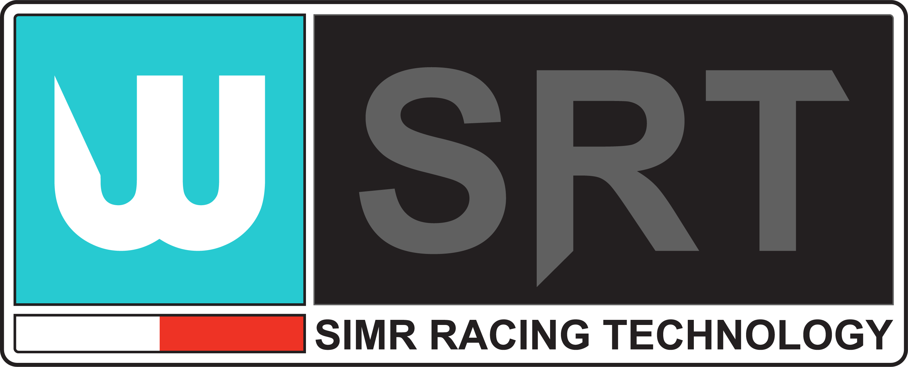
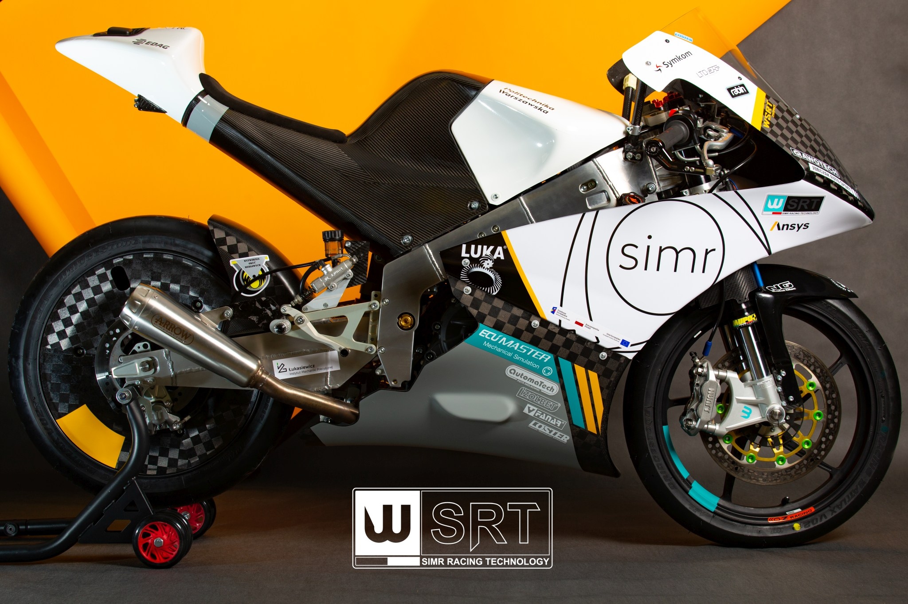

# WUT SiMR Racing Technology

This repository contains the software components developed for WUT SiMR Racing Technology student motorcycle project.

## Introduction

Since 2017, WSRT has been operating as a collaboration between students from the Warsaw University of Technology and the Academy of Fine Arts in Warsaw.
We specialize in the design, research, and creation of all things related to motorcycle racing. 
This project is the first racing motorcycle in Poland designed according to the regulations of the academic MotoStudent series.

## Features

* Real-time Data Monitoring
* Telemetry and Logging
* Performance Optimization
* User Interface

## Contents 

### Pi Projects
This directory contains projects related to the On-Board Computer (OBC) of the motorcycles. The OBC handles tasks such as processing GPS data, collecting sensor data, and sending this information to the cloud for further analysis.
These projects are designed to enhance the motorcycle's functionality by integrating advanced data processing and cloud connectivity. They enable real-time monitoring, data storage, and remote access to critical motorcycle information.

### Pico Projects
Within this directory, you'll find projects dedicated to various microcontroller units.
These projects focus on creating solutions for measuring and providing essential data to the OBC.
These MCUs are likely embedded within the motorcycle's components to gather data and provide insights into the vehicle's performance. 
By developing these projects, we're able to extract valuable data that contributes to the optimization and performance enhancement of the motorcycle.

## Stay Connected

Stay updated with our latest projects and news by following us on social media and visiting our website:

- Website: [https://www.wsrt.pl](https://www.wsrt.pl)
- Twitter: [@wutsimracing](https://twitter.com/wutsimracing)
- Facebook: [WUT SiMR Racing Technology](https://www.facebook.com/wutsimracing/)
- Instagram: [@wutsimracingtech](https://www.instagram.com/wutsimracingtech/)
  
For professional inquiries or collaborations, please contact us via email at [kontakt@wsrt.pl](mailto:kontakt@wsrt.pl).
